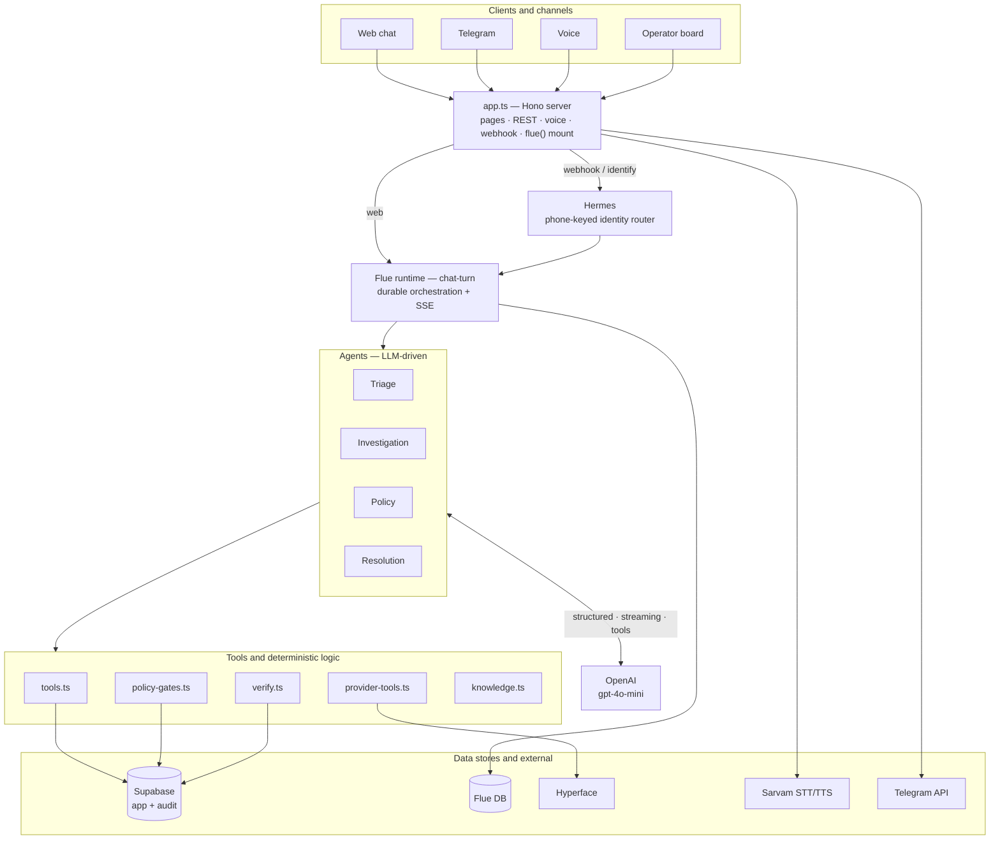
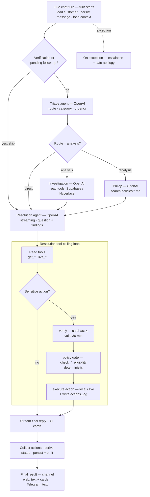

# Kriya: Autonomous Credit-Card Copilot

Kriya is an autonomous, customer-facing CardOps copilot for modern Indian credit card programs. Built on a durable agentic workflow engine, Kriya enables cardholders to check live accounts, lock or replace cards, convert purchases to EMI, redeem rewards, and resolve refund/chargeback and fraud cases in plain language (or via voice) while enforcing strict regulatory policy gates.

---

## Core Capabilities

Kriya acts as a plain-language translator and execution layer for the [Hyperface Credit Stack](https://hyperface.stoplight.io/docs/credit-stack-apis/).

### 1. Accounts & Balances
* **Live Account Summary**: Fetches current ledger balance, available credit, cash limits, and overall card utilization in real time.
* **Account Records**: Reads product variant metadata, billing cycles, status, and key cardholder dates.

### 2. Card Management & Security
* **Emergency Operations**: Executes a card lock (reversible freeze) or permanent hotlisting (irreversible disable) on the live card during fraud events.
* **Replacement Routing**: Places a card replacement order (e.g., damaged or stolen cards) in the card system of record.

### 3. Transactions & Statements
* **Dynamic Ledgers**: Queries billed and unbilled transactions over any custom date window.
* **Statement Access**: Reads statement histories, billing totals, and minimum dues, and retrieves a specific statement's document by id.
* **Transaction Inquiries**: Inspects specific transaction details by reference ID to answer cardholder queries.

### 4. EMI & Pay Later
* **Tenure Eligibility**: Checks tenure options, interest rates, and monthly installment options for eligible purchases.
* **EMI Conversions**: Converts outstanding billing amounts or specific transactions into equated monthly installments.
* **Early Settle & Foreclose**: Computes foreclosure fees and executes EMI foreclosures against the ledger.

### 5. Rewards & Cashback
* **Live Points Balance**: Tracks earned, pending, redeemed, and expiring points.
* **Ledger History**: Inspects point postings associated with specific purchases.
* **Instant Redemption**: Redeems available reward points directly against the current card balance.
* **Cashback Activity**: Reads transaction-level cashback earned and reversed from the card system.

### 6. Refunds, Fraud & Escalations
* **Refunds & Chargebacks**: Posts refund or chargeback credits to the account in the card system of record (Hyperface has no separate dispute object — reversals are credit postings), behind a deterministic duplicate-charge gate.
* **Fraud Liability Assessment**: Deterministic RBI limited-liability band check (zero / limited / per-policy from the working days to report), then routes the case to Fraud Operations.
* **Kanban Operator Dashboard**: A web dashboard at `/tickets` letting operations teams review customer escalation histories, the account snapshot on file, audit trails, and log notes.

---

## Agent Architecture

Kriya coordinates user requests using a durable **Flue Workflow** that routes requests through specialized, cooperating agents:


### Specialized Agents:
1. **Triage Agent**: Classifies intent into a category, detects urgency, and routes the turn `direct` vs `analysis`.
2. **Investigation Agent**: Conducts read-only queries against the database and card ledger APIs to build context.
3. **Policy Agent**: Searches the local Markdown policy corpus and returns advisory eligibility guidance, SLAs, and key rules. The binding deterministic checks live in the policy gates, not here.
4. **Resolution Agent**: Enforces identity checks, runs the deterministic policy gates, compiles visual cards, and triggers ledger modifications.

---

## Architecture & Workflow Diagrams

### Complete architecture

Seven layers: clients and channels reach the Hono HTTP server, which routes through Hermes and the Flue workflow runtime to four LLM agents (each calling OpenAI) and a set of deterministic tools, all backed by Supabase, the Flue database, and external services.



### Full agentic workflow (one chat turn)

A turn enters the Flue `chat-turn` workflow, is routed by Triage, optionally fans out to parallel Investigation and Policy agents, then reaches Resolution, whose tool-calling loop reads data, verifies identity, runs a deterministic gate, executes a local or live action with an audit log, and streams the final reply. Any exception creates an escalation.



> Standalone SVG copies of both diagrams render in `diagrams/` (kept local — see `.gitignore`).

---

## Project Directory Structure

```
├── app.ts                        # Hono HTTP Server: handles routing, webhooks, and REST APIs
├── db.ts                         # Local Flue database persistence settings
├── agents/                       # Specialized AI agent definitions
│   ├── triage.ts                 # Intent classifier & router
│   ├── investigation.ts          # Read-only ledger research agent
│   ├── policy.ts                 # Policy extraction agent
│   └── resolution.ts             # Enforcement and mutation agent
├── channels/                     # Third-party chat channel adapters
│   ├── telegram.ts               # Telegram webhook verification and message handler
│   └── hermes.ts                 # Inbound routing and identity matching engine
├── core/                         # Core platform logic
│   ├── queries.ts                # Main database access layers (Supabase)
│   ├── env.ts                    # Hosted guardrails and configuration
│   └── supabase.ts               # Supabase client credentials wrapper
├── providers/                    # Core banking / credit ledger integrations
│   └── hyperface.ts              # UAT endpoint bindings for the Hyperface Credit Stack
├── services/                     # Business services
│   ├── policy-gates.ts           # Deterministic gates: late-fee waiver, duplicate refund, EMI conversion, fraud liability
│   ├── verify.ts                 # Identity checking logic
│   └── voice.ts                  # Voice mode: Sarvam STT & TTS translation
├── ui/                           # Frontend HTML, CSS, and Client JS
│   ├── start.html / start.css    # Landing page
│   ├── chat.html / chat.js       # Live chat client with voice wave animations
│   └── tickets.html / tickets.js # Kanban board for customer service agents
└── workflows/                    # Orchestrations
    └── chat-turn.ts              # Stateful conversation loop
```

---

## Getting Started

### Prerequisites
* **Node.js** ≥ 22.18
* **Supabase** instance configured for Kriya schemas
* **OpenAI API Key** (for general agent reasoning)
* **Sarvam API Key** (required for Multilingual Voice Mode)

### Installation
1. Clone the repository and install dependencies:
   ```bash
   npm install
   ```

2. Create a `.env` file from the template:
   ```bash
   cp .env.example .env
   ```

3. Populate `.env` with your credentials:
   ```env
   PORT=3583
   NEXT_PUBLIC_SUPABASE_URL=https://your-project.supabase.co
   SUPABASE_SERVICE_ROLE_KEY=your-supabase-service-key
   OPENAI_API_KEY=your-openai-api-key
   SENTINEL_MODEL=openai/gpt-4o-mini
   SARVAM_API_KEY=your-sarvam-voice-api-key
   KRIYA_PROVIDER_MODE=hyperface_uat
   HYPERFACE_TENANT_ID=your-hyperface-tenant-id
   HYPERFACE_ACCESS_KEY=your-hyperface-access-key
   HYPERFACE_SECRET_KEY=your-hyperface-access-secret
   HYPERFACE_ISSUER_SECRET_KEY=your-issuer-master-key
   HYPERFACE_PROGRAM_ID=your-hyperface-program-id
   # Set to false to keep all live card mutations gated (reads still work)
   HYPERFACE_ALLOW_MUTATIONS=true
   ```
   > See `.env.example` for the full set of variables, including `DATABASE_URL`/`KRIYA_DEPLOYED` for hosted deployments and the Telegram webhook keys.

### Execution
* **Development Server (Hot reloading)**:
  ```bash
  npm run dev
  ```
* **Production Build**:
  ```bash
  npm run build
  ```
* **Production Run**:
  ```bash
  npm run start
  ```
