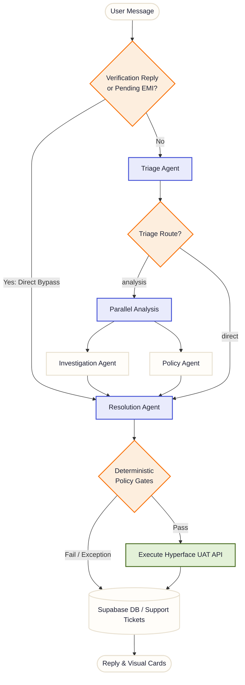

# Kriya: Autonomous Credit-Card Copilot

Kriya is an autonomous, customer-facing CardOps copilot for modern Indian credit card programs. Built on a durable agentic workflow engine, Kriya enables cardholders to manage accounts, configure controls, convert purchases to EMI, and resolve disputes in plain language (or via voice) while enforcing strict regulatory policy gates.

---

## Core Capabilities

Kriya acts as a plain-language translator and execution layer for the [Hyperface Credit Stack](https://hyperface.stoplight.io/docs/credit-stack-apis/).

### 1. Accounts & Balances
* **Live Account Summary**: Fetches current ledger balance, available credit, cash limits, and overall card utilization in real time.
* **Account Records**: Reads product variant metadata, billing cycles, status, and key cardholder dates.
* **Credit Limit Updates**: Computes eligibility and executes limit increases or decreases.

### 2. Card Management & Security
* **Emergency Operations**: Instantly executes a card lock (reversible freeze) or permanent hotlisting (irreversible disable) during fraud events.
* **Usage Controls**: Toggles online transactions, physical POS, tap to pay, ATM withdrawals, and international usage instantly.
* **Replacement Routing**: Places card replacement orders (e.g., damaged or stolen cards) with auto-address verification.

### 3. Transactions & Statements
* **Dynamic Ledgers**: Queries billed and unbilled transactions over any custom date window.
* **Statement Access**: Generates statement histories, billing totals, minimum dues, and provides direct PDF document downloads.
* **Transaction Inquiries**: Inspects specific transaction details by reference ID to answer cardholder queries.

### 4. EMI & Pay Later
* **Tenure Eligibility**: Checks tenure options, interest rates, and monthly installment options for eligible purchases.
* **EMI Conversions**: Converts outstanding billing amounts or specific transactions into equated monthly installments.
* **Early Settle & Foreclose**: Computes foreclosure fees and executes EMI foreclosures against the ledger.

### 5. Rewards & Cashback
* **Live Points Balance**: Tracks earned, pending, redeemed, and expiring points.
* **Ledger History**: Inspects point postings associated with specific purchases.
* **Instant Redemption**: Redeems available reward points directly against the current card balance.
* **Cashback Activity**: Tracks transaction-level cashback rules and reversals.

### 6. Regulatory Compliance & Support
* **Fee Waivers**: Auto-waives annual, late, or over-limit fees (governed by RBI compliance limits and credit profiles).
* **Dispute Lifecycles**: Files and tracks formal disputes/chargebacks within RBI-mandated SLA timelines.
* **Kanban Operator Dashboard**: A web dashboard at `/tickets` allowing operations teams to review customer escalation histories, live card balances, audit trails, and log notes.

---

## Agent Architecture

Kriya coordinates user requests using a durable **Flue Workflow** that routes requests through specialized, cooperating agents:



### Specialized Agents:
1. **Triage Agent**: Classifies intent, detects urgency, and extracts key entities (e.g. amounts, dates, channels).
2. **Investigation Agent**: Conducts read-only queries against the database and card ledger APIs to build context.
3. **Policy Agent**: Matches user requests against deterministic rules (e.g., limit check, maximum waiver policies).
4. **Resolution Agent**: Enforces identity checks, validates policy gates, compiles visual cards, and triggers ledger modifications.

---

## Project Directory Structure

```
├── app.ts                        # Hono HTTP Server: handles routing, webhooks, and REST APIs
├── db.ts                         # Local Flue database persistence settings
├── agents/                       # Specialized AI agent definitions
│   ├── triage.ts                 # Intent classifier & router
│   ├── investigation.ts          # Read-only ledger research agent
│   ├── policy.ts                 # Policy extraction agent
│   └── resolution.ts             # Enforcement and mutation agent
├── channels/                     # Third-party chat channel adapters
│   ├── telegram.ts               # Telegram webhook verification and message handler
│   └── hermes.ts                 # Inbound routing and identity matching engine
├── core/                         # Core platform logic
│   ├── queries.ts                # Main database access layers (Supabase)
│   ├── env.ts                    # Hosted guardrails and configuration
│   └── supabase.ts               # Supabase client credentials wrapper
├── database/                     # DB schemas and migrations
├── providers/                    # Core banking / credit ledger integrations
│   └── hyperface.ts              # UAT endpoint bindings for the Hyperface Credit Stack
├── services/                     # Business services
│   ├── policy-gates.ts           # Rules engine for fee waivers, limits, and disputes
│   ├── verify.ts                 # Identity checking logic
│   └── voice.ts                  # Voice mode: Sarvam STT & TTS translation
├── ui/                           # Frontend HTML, CSS, and Client JS
│   ├── start.html / start.css    # Landing page
│   ├── chat.html / chat.js       # Live chat client with voice wave animations
│   └── tickets.html / tickets.js # Kanban board for customer service agents
└── workflows/                    # Orchestrations
    └── chat-turn.ts              # Stateful conversation loop
```

---

## Getting Started

### Prerequisites
* **Node.js** ≥ 22.18
* **Supabase** instance configured for Kriya schemas
* **OpenAI API Key** (for general agent reasoning)
* **Sarvam API Key** (required for Multilingual Voice Mode)

### Installation
1. Clone the repository and install dependencies:
   ```bash
   npm install
   ```

2. Create a `.env` file from the template:
   ```bash
   cp .env.example .env
   ```

3. Populate `.env` with your credentials:
   ```env
   PORT=3583
   NEXT_PUBLIC_SUPABASE_URL=https://your-project.supabase.co
   SUPABASE_SERVICE_ROLE_KEY=your-supabase-service-key
   OPENAI_API_KEY=your-openai-api-key
   SARVAM_API_KEY=your-sarvam-voice-api-key
   KRIYA_PROVIDER_MODE=hyperface_uat
   HYPERFACE_SECRET_KEY=your-hyperface-access-secret
   HYPERFACE_ISSUER_SECRET_KEY=your-issuer-master-key
   ```

### Execution
* **Development Server (Hot reloading)**:
  ```bash
  npm run dev
  ```
* **Production Build**:
  ```bash
  npm run build
  ```
* **Production Run**:
  ```bash
  npm run start
  ```
